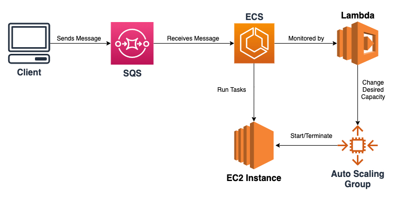

<h1 align="center">Self Terminating ECS Worker CDK</h1>

This project provides an example for creating worker processes using ECS that automatically scales EC2 instance counts to 0 when a task is done.

This CDK will create the following resources on a high level:

- ECS Cluster
- ECS Task Definition
- EC2 AutoScaling Group
- EC2 Instance (Refer to environment variable for instance type)
- SQS Queue
- Lambda Function

## Motivation

AWS has a wide variety of tools to deploy and scale worker processes like Lambda, SageMaker, ECS and Elastic Beanstalk. However, when highly customization, scaling and cost-optimization is needed you're left with custom solutions.

I initially created this fairly simple template to asynchronously retrieve messages from a queue and use them in a Machine Learning pipeline.

## How it works

First, a client must send messages to the SQS queue created by this CDK stack.

Then the docker image in worker folder will be deployed as an ECS Task Definition and will be ready to process messages using the function you created and referenced in [run.py](lib/worker/run.py).

Based on the [CRON_RATE](.env.example), the lambda function will be invoked every X intervals. When invoked, it will initialize the instance associated with this cluster, place the task and terminate itself when the task is done.

## Usage

1-) Run `yarn` or `npm install`.

1-) Refer to [AWS CDK Getting Started Guide](https://docs.aws.amazon.com/cdk/v2/guide/getting_started.html) to set-up aws cdk in your machine.

2-) Create a python function that will process the messages retrieved from the queue and add it to worker folder.

3-) Set [environment variables](#env)

4-) Reference the python function by passing the data parameter from message in [worker/run.py](lib/worker/run.py) file.

    print(data)
    # Some worker process here
    # e.g. worker_process(data)

5-) Run `yarn cdk bootstrap`, this will create the CDK Toolkit Stack to your AWS account so that it can be deployed afterwards.

6-) Deploy using `yarn cdk deploy`

<h2 id="env">Environment Variables</h2>

Variables denoted with * are required!

**EC2_INSTANCE_TYPE\***: String = The instance type associated with the cluster. Use the dotted string notation. e.g. t2.micro, a1.medium...

**GPU_ENABLED**\*: 0 or 1 = If the instance requires a GPU hardware. Such as g4dn.\* instances, keep in mind that these will come with NVidia CUDA pre-installed so you can work with it.

**ARM_INSTANCE**\*: 0 or 1 = If the instance is ARM-based. Such as a1.\* instances.

**ECS_TASK_DEFINITION_MEMORY_LIMIT**\*: Number = Soft memory limit for the docker container. Since we'll be running one task on one instance with this stack all the time, you can set this number equal to the memory of your [selected instance](https://aws.amazon.com/tr/ec2/instance-types/). e.g. 2048 for t2.small

**AWS_SECRET_ACCESS_KEY**\*: Self-explanatory. Should belong to an IAM Role with enough permissions.

**AWS_ACCESS_KEY_ID**\*: Self-explanatory. Should belong to an IAM Role with enough permissions.

**AWS_DEFAULT_REGION**\*: e.g. us-east-1

**CRON_RATE**\*: Indicates the frequency you want to run this task. Should be all uppercased and snake_case format. e.g. 7_HOURS, 1_HOUR, 1_MINUTE, 2_SECONDS
